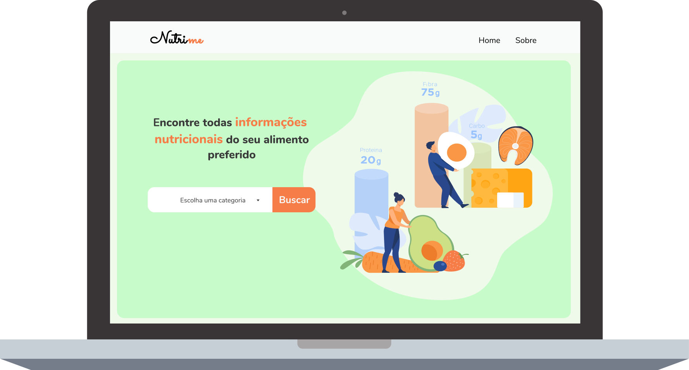
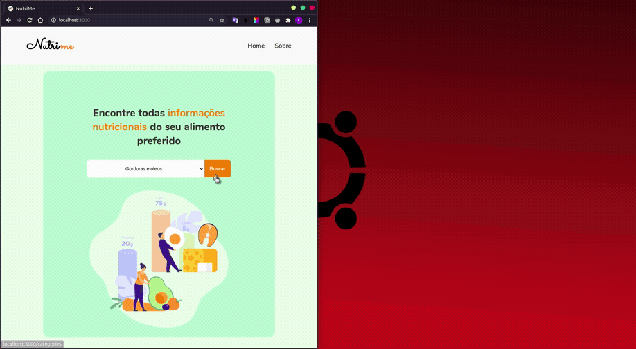

<h1 align="center">
    
</h1>

<p align="center">
  <a href="#sobre">Sobre</a>&nbsp;&nbsp;&nbsp;|&nbsp;&nbsp;&nbsp;
  <a href="#tecnologias">Tecnologias</a>&nbsp;&nbsp;&nbsp;|&nbsp;&nbsp;&nbsp;
  <a href="#como-executar">Como Executar</a>&nbsp;&nbsp;&nbsp;|&nbsp;&nbsp;&nbsp;
  <a href="#screenshots">Screenshots</a>
</p>
<br/>
<p align="center">
  
<p>

## Sobre

O **NutriMe** é uma aplicação Web responsiva feita para auxiliar no obtimento de informações nutricionais dos principais alimentos nacionais e regionais a partir do banco de dados da [**TACO**](http://www.nepa.unicamp.br/taco/home.php?ativo=home), a mesma obteve suas informações por meio de amostragem representativa e análises realizadas por laboratórios com competência analítica comprovada por estudos interlaboratoriais, segundo critérios internacionais.

Para saber mais sobre essa API consulte [API TACO](https://github.com/raulfdm/taco-api).

## Tecnologias
-  Node.js
-  ReactJS
-  Axios
-  Redux
-  Jquery

## Como Executar

- ### **Pré-requisitos**

  - É **necessário** possuir o **[Node.js](https://nodejs.org/en/)** instalado no computador
  - É **necessário** possuir o **[Git](https://git-scm.com/)** instalado e configurado no computador
  - Também, é **preciso** ter um gerenciador de pacotes seja o **[NPM](https://www.npmjs.com/)** ou **[Yarn](https://yarnpkg.com/)**.

1. Faça um clone do repositório:

```sh
  $ git clone https://github.com/LuhBezerra/nutriMe.git
```

2. Executando a Aplicação:

```sh
  $ cd nutriMe
  # Instalando as dependências do projeto.
  $ yarn # ou npm install
  # Inicie a aplicação web
  $ yarn start # ou npm start
```

## Screenshots

<h1 align="center">
    
    <br></br>
    
</h1>

<sup>Projeto desenvolvido por  ❤︎ [Lucilene Bezerra](https://github.com/LuhBezerra)</sup>